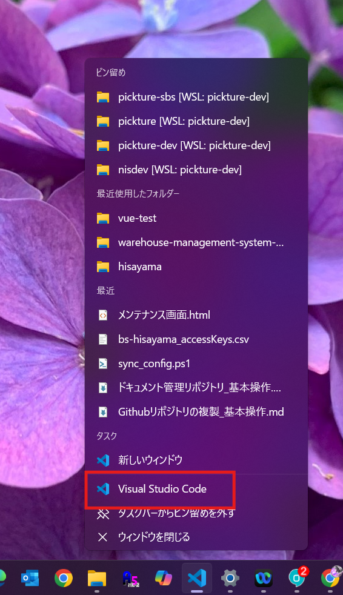
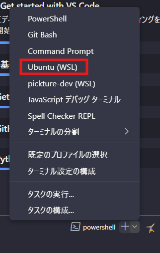
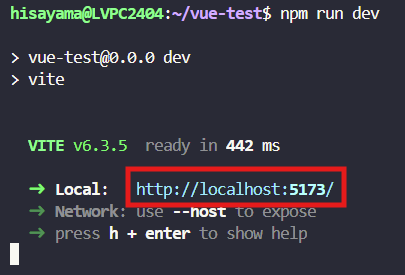

# Vue 3 + Vite

This template should help get you started developing with Vue 3 in Vite. The template uses Vue 3 `<script setup>` SFCs, check out the [script setup docs](https://v3.vuejs.org/api/sfc-script-setup.html#sfc-script-setup) to learn more.

Learn more about IDE Support for Vue in the [Vue Docs Scaling up Guide](https://vuejs.org/guide/scaling-up/tooling.html#ide-support).


# 📝 Vue3 環境セットアップ手順（Windows + VSCode + WSL）

## 🎯 目的

VSCode から Vue3 テンプレート画面をローカルで開けるまでの手順。
GitHub 連携（Push）まで含む。

---

## ① 必要なものを用意

- **VSCode**（インストール済み）
- **GitHub アカウント**（作成済み）
- **GitHub Desktop または Git CLI**
- **WSL（Ubuntu）**
  - WSLが入ってない場合は以下参考：[Microsoft公式](https://learn.microsoft.com/ja-jp/windows/wsl/install)

---

## ② WSL セットアップ

1. vscodeを新規で開く
　アイコンを右クリックしてvscodeを新規で開きます


2. **VSCode で WSL 拡張機能（Remote - WSL）をインストール**
3. ターミナルを開く（`Ctrl` + `Shift` +  <code>`</code>）



    - `WSL` のプロンプトに切り替える（`zsh` or `bash` でOK）

1-1. フォルダの新規作成
順番にコマンドを入力

```bash
cd ~
mkdir vue-test
```

---

## ③ Node.js + npm インストール

### nvm (Node Version Manager) からnpm（Node.jsのパッケージ管理ツール）をインストール

```bash
curl -o- https://raw.githubusercontent.com/nvm-sh/nvm/v0.39.7/install.sh | bash
```
```bash
source ~/.bashrc
```
### Node.js 最新LTS版インストール

```bash
nvm install --lts

```
```bash
node -v
npm -v
```

### Vite公式が提供している 「プロジェクト作成用スクリプト」を実行

```bash
npm create vite@latest . -- --template vue
```

次に依存パッケージのインストール

```bash
npm install
```

### サーバーを立ち上げる

これで最後！

```bash
npm run dev
```
任意のブラウザのアドレスバーに`http://localhost:5173/`を入力してください！

